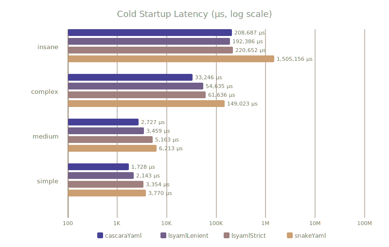
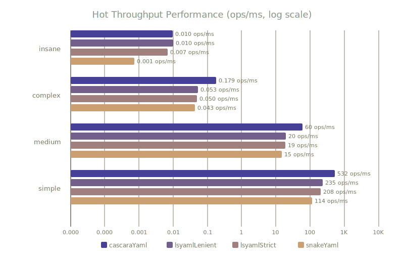

# YAML Parser Performance Comparison

Executed on OpenJDK 25 (Zulu 25+36-LTS). Warmed-up metrics measure Throughput (ops/ms, higher is better). Cold Start metrics measure Single-Shot execution (us/op, lower is better).

Benchmarks were made using the [cascara-test-benchmark](https://github.com/qishr/cascara-test-benchmark).

For CLI tools, short-lived serverless tasks, or developer environment initializations, cold startup is what developers actually experience. Cascara eliminates the heavy framework tax:

Once the JVM optimizes the execution path, Cascara dominates mid-sized configurations and complex, anchor-heavy structural trees.

---

