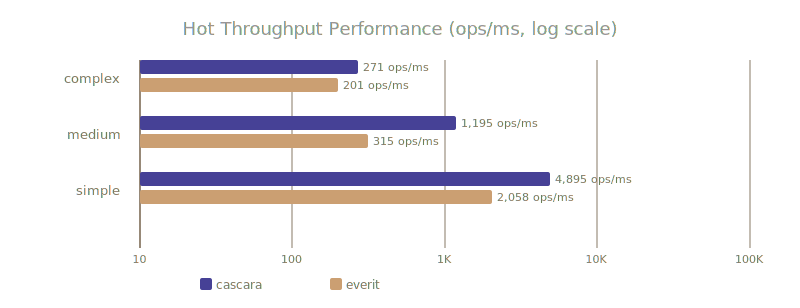
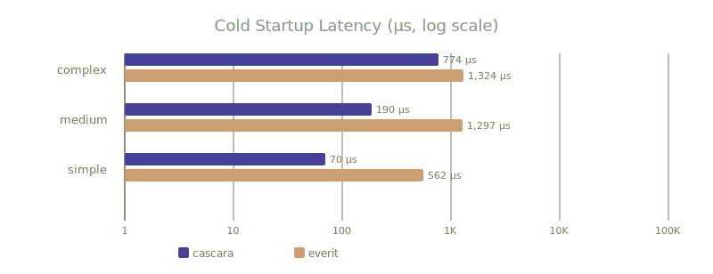

# Cascara Schema

Cascara's schema system is built on JSON Schema draft 2020-12, so existing schemas work without modification. The default meta-schema URI is `https://json-schema.org/draft/2020-12/schema`.

One Cascara-specific extension is the `res://` URI scheme, which lets schemas and data files reference resources bundled inside the application, rather than requiring an HTTP endpoint or an absolute file path. This is particularly useful during development and testing, or for applications that ship their schemas as classpath resources.

The schema used in these examples is standard JSON Schema — Cascara adds nothing proprietary:

```json
{
    "$schema": "res:///io/github/qishr/cascara/docs/examples/schema/schema.json",
    "name": "Dave",
    "age": 31
}
```

The schema itself is standard JSON Schema — Cascara adds nothing proprietary:

```json
{
    "$id": "https://example.com/person.schema.json",
    "$schema": "https://json-schema.org/draft/2020-12/schema",
    "type": "object",
    "properties": {
        "name": { "type": "string" },
        "age":  { "type": "number" }
    },
    "required": [ "name", "age" ]
}
```

In the examples below, the valid document has `name` as a string and `age` as a number. The invalid document has them swapped — `name` is a number and `age` is a string — so you can see exactly what each validation approach reports when constraints are violated.

## Schema Validation

Cascara's schema validator works directly with the AST produced by any of its language processors — there's no separate parsing step for the schema itself, and no string-based intermediate representation. Validation is just another operation on the same node tree you already have.

There are three ways to validate, depending on how much control you need over error handling.

### Validate with Exception

The simplest approach. SchemaValidator throws a ValidationException on the first error, which you catch and handle as normal. If you're coming from a library like Jackson with the everit JSON Schema validator, this will feel immediately familiar.

```java
--8<-- "examples/schema/ValidateWithException.java"
```

SchemaValidator without arguments uses auto-discovery to find the schema — Cascara will look for a schema registered for the content type of the data being validated.

### Validate with Collector

Rather than throwing on the first error, this approach fires a callback for each problem encountered, letting validation run to completion and keeping errors in the normal flow of your program. This is particularly useful when you want to collect and display all validation errors at once — for example, in a form validation scenario or a linter.

```java
--8<-- "examples/schema/ValidateWithCollector.java"
```

Unlike the exception-based approach, ValidateWithCollector continues past the first error. The SilentCollectingReporter suppresses internal diagnostic noise while routing validation problems to your callback.

### Validate with an Explicit Schema

When you want full control over which schema is used — loading it from a specific location, compiling it once, and reusing it across multiple validations — you can compile the schema explicitly and call validate directly on it.

```java
--8<-- "examples/schema/ValidateWithSchema.java"
```

Behind the scenes, SchemaResolver caches compiled schemas, so a schema is typically only compiled once regardless of how many times it's referenced. The main reason to compile a schema explicitly and call validate directly on it is control — you choose exactly which schema is used, rather than relying on auto-discovery via the $schema property in the data.


## Performance




